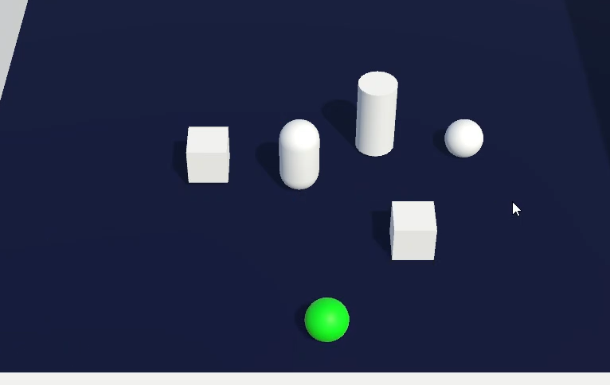
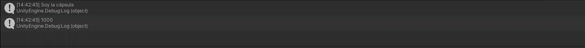
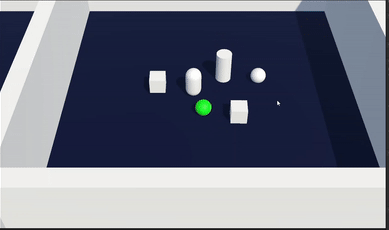
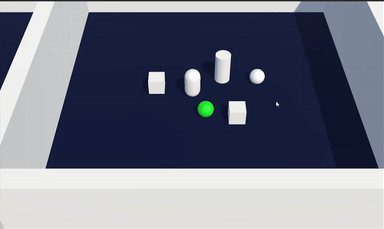
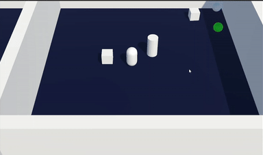
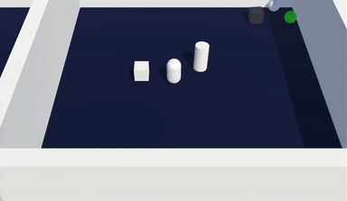

# Autoría
**Nombre:** Lucas Hernández Abreu

**Email:** alu0101317496@ull.edu.es

# Informe
En esta práctica se nos pedía cumplimentar dos tareas

- 1 - Crear una escena simple en Unity, con dos objetos: Notificador y 
      Suscriptor y prueba el código en las transparencias.

- 2 - Crear una escena en únity, con objetos de tipo A, B y un único objeto 
      tipo C con los siguientes comportamientos:

  - 1. Cuando el jugador colisiona con un objeto de tipo b, los objetos de 
        tipo A se acercan al objeto de tipo C. Cuando el jugador toca algún 
        objeto de tipo A, el tamaño de los objetos tipo B se ve incrementado.

  - 2. Cuando el jugador se aproxima al objetivo de tipo C, los objetos de tipo
        A cambian su color y saltan, los objetos de tipo B se orientan hacia un
        objetivo ubicado a la escena. Consulta información de la clase Vector3:
        LookAt, RotateTowards, ...

  - 3. Buscar información de `Debug.DrawRay` y utilízala para depuración.

## Escena con objetos básicos:
Para realizar este apartado he creado los objetos `Capsula` y `Cubo` que se
comunicarán mediante mensajes.

El mensaje se enviará cada 1000 iteraciones.
- Escena:

- Mensajes del notificador


## Manipulación de objetos y mensajes
### Objetos:
- Tipo A: Cuadrado
- Tipo B: Cilindro
- Tipo C: Esfera blanca
### 2 - i.
Para que se detecte la colisión del jugador con el cilindro (tipoB) he hecho
al objeto de tipo 'is-trigger', una vez colisiona con él, envía un mensaje a 
los subscriptores de este. 
El Cubo (tipoA) se acerca a la Esfera (tipoC) mediante la función de `Vector3`:
`Lerp`; y la función de `Rigidbody`: `MovePosition`.

Esta función recibe una posición de salida, una de llegada y una velocidad de
desplazamiento.

Cuando el jugador toca el Cubo, el cilindro aumenta su tamaño. Se llevó a cabo
utilizando el `LocalScale` de transform. Luego recupero el tamaño del cilindro
para no tener una pantalla ocupada únicamente con el cilindro.




### 2 - ii.

El objeto tipoC detecta que el jugador se ha acercado y hace que los objetos
de tipoA salten y cambien de color.

Para que salten he usado la función `AddForce` con el tipo de fuerza `Impulse`.
Para que cambien de color he usado la siguiente línea de código:
```cs
gameObject.GetComponent<Renderer>().material.color = Random.ColorHSV();
```
Con esta línea obtengo un color aleatorio y se lo aplico a los objetos de tipoA.

Si nos fijamos en el gif, también veremos como el cilindro se orienta hacia
el objeto de tipoA (el que acaba de saltar).

Para esta función he utilizado `LookAt` de transform. Esta función recibe como
argumento un punto al que orientarse de tipo `Vector3`.



`LookAt`: Es una función que recibe un `Vector3` al que se orientará,
incluso rotando el propio objeto para ponerse frente al objetivo.

### 2 - iii.



`Debug.Ray`: Se imprime un rayo desde un punto A(`Vector3`) hasta otro punto B(`Vector3`).
Este rayo sólo se puede divisar en la Escena.
